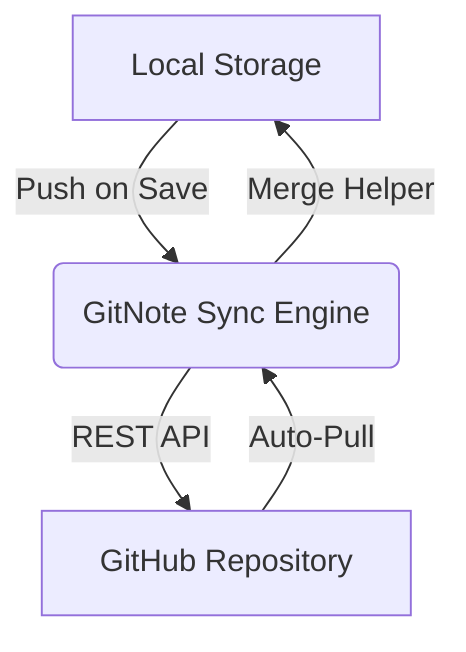

# 📝 GitNote 

> **Empowering your knowledge base with the power of Git.**

GitNote is a high-performance, developer-centric Markdown note-taking application. Unlike traditional note apps, GitNote treats your GitHub repositories as first-class citizens, providing seamless, real-time synchronization, intelligent merging, and robust point-in-time recovery.

---

## 🚀 Key Features in v1.1.0

### 🏷️ Advanced Visual Tagging System
- **@Tags**: Organize your notes effortlessly by typing `@tags` anywhere in your markdown.
- **Deep Filtering**: Tap a tag on the Home Screen to instantly filter and surface all matching notes across your *entire directory tree*.
- **Vibrant Tags Bar**: A dedicated visual bar in the editor beautifully separates your tags from plain text.

### ✍️ Professional Native Editor & Live Mode
- **Live Markdown Editing**: Toggle Live Edit Mode in Settings to instantly render formatting as you type!
- **Sleek Formatting Toolbar**: A feature-rich toolbar offering quick-access to Bold, Italic, Headings, Lists, Images, and one-tap tag insertion.
- **Seamless Cursor Management**: Effortlessly place your cursor precisely where you want it.

### 🔄 Intelligent Synchronization
GitNote manages your notes with a sophisticated sync engine that handles **Automated Pull/Push cycles**, ensuring your local device and GitHub are always in parity.
- **Smart Merge Helper**: Resolves conflicts locally using a triple-diff logic.
- **Background Sync**: Stays up-to-date even when the app is in the background.

### 🛡️ Time-Travel Recovery
Lost a note? Deleted a folder? No problem.
- **Commit History**: Browse the last 20 commits directly from the app.
- **Granular Restore**: Perform file-level or folder-level restorations of your local workspace from any point in your GitHub history without wiping your entire app.

### 🎨 Premium User Experience
- **Material 3 UI**: A sleek Indigo & Emerald theme designed for focus and productivity.
- **File Tree Sorting**: Sort your notes alphabetically or by Date Modified.
- **Unified Controls**: A custom Floating Control Bar for single-tap sync and note creation.
- **Drag-and-Drop**: Organize your notes effortlessly with intuitive folder movement.

---

## 🛠️ Technical Architecture



### Stack
- **Flutter**: Cross-platform frontend excellence.
- **Provider**: Robust reactive state management.
- **GitHub REST API**: Level 3 hypermedia integration.
- **Material 3**: The latest design tokens from Google.

---

## 📥 Installation

### Developer Setup
1. **Clone**: `git clone https://github.com/SchoferMorningstar/GitNote.git`
2. **Setup**: `flutter pub get`
3. **Run**: `flutter run`

### Release Build
To generate a production APK:
```bash
flutter build apk --release
```

---

## 🏷️ Configuration
The app uses a secure Device Flow for GitHub authentication. No manual token entry required! The `clientId` is pre-configured in `AppConfig`.
You can support the developer directly through the app by configuring `TIP_URL` in your `.env` file!

---

## 📜 Roadmap
- [x] GitHub Sync & Conflict Resolution
- [x] Point-in-time Recovery
- [x] Material 3 Visual Overhaul
- [x] Advanced Tagging & Deep Filtering
- [ ] Multi-repository support
- [ ] End-to-end encryption for private repos

---
Developed by **SchoferMorningstar**.
